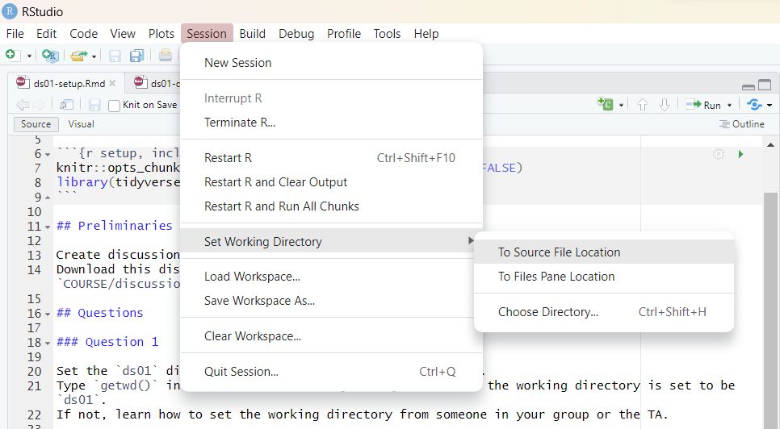

## Personal Introduction

* Cameron Jones
  + Second year PhD student in Statistics; got my bachelor's degree in Statistics here at UW
  + From Hartland, WI
  + Talk to me about; Premier League or really any sports statistics, Studio Ghibli movies, Zelda games
  
* How you can reach me
  + Email (cjones46@wisc.edu)
  + Discord
  + Office drop-in hours (Tuesday 9:00-10:30am in MSC 1274)

See my announcement on Canvas and/or the course home page for more details.

## The Course and Discussion

* Overall course flow
  + Five week crash course in tidyverse/R basics with discussion group 1
  + Midterm, then switch discussion groups
  + Remainder of semester spent implementing basic statistical concepts in R with discussion group 2
  
* Week-to-week flow
  + Exposure to new content during lectures
  + Low-stakes group discussion assignment for completion (on Monday/Tuesday)
  + Higher-stakes individual assignment for correctness (due Fridays)
  
* What does discussion look like?
  + Short review of concepts (~ 5 minutes)
      + I post these review files to Files > Discussion Reviews
  + Remaining time spent on group discussion assignment
  + Participation is 10% of your grade - you get two free drops
  
## Today

* **Individual** assignment to make sure your R, RStudio, and tidyverse work, that you can interact with course files correctly, and practice knitting an html file. 

### Important Notes for the Discussion Assignment

* ```COURSE``` refers to your "home folder". It can be named whatever you want, but it is the highest-level folder, which houses the folders "data", "discussion", "homework", et cetera.

* You must name the data folder **"data"**, all lowercase, or the code we give you won't work. 

* Download ```ds01-setup.Rmd``` to the directory ```COURSE/discussion/ds01``` and **edit that file directly! You do not need to create a new file.**

* It will look for the file ```lake-mendota-winters-2022.csv``` in the directory ```COURSE/data```. If you get "file not found in the current working directory", ensure you've downloaded files to the correct directory according to this bullet and the one above it.

* Shortcut to set the working directory:



* After clicking knit, it will create ```ds01-setup.html``` next to ```ds01-setup.Rmd```. **Please submit both to Canvas!** (this is true for homework assignments too... it helps me give you more points if something goes wrong!)

