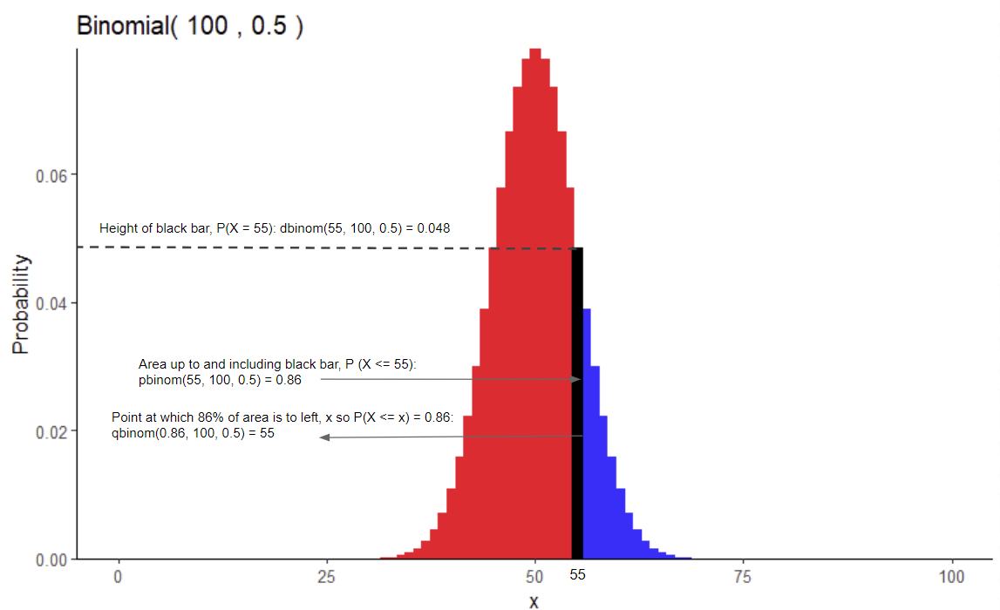

# Logistics

* 500+ midterms will take a while to grade, thanks in advance for bearing with us!

* Turning point in the course
  +   Up to now: R/tidyverse basics, "data manipulation" crash course
  +   From here on out: More statistical/mathematical concepts, *implementing* and *reporting* on these concepts in R
  +   Your final project (eventually) will need you to demonstrate skills of both!
  
  
  
* Discussion Feedback Survey (https://forms.gle/vZB5aTGMAfgmUzqp8)
  +   Your opportunity to have a say in how discussions go, let me know how the course is going for you
  +   Thank you to those who have already responded!
  
* New discussion groups starting today, through the end of the course

# Content Review: The Binomial Distribution

### What is a "distribution" and why should I care?

Math-speak: A probability distribution is a function which maps the set of experimental outcomes to probabilities in [0, 1], which must sum to 1.

Informal-speak: A probability distribution quantifies exactly how likely the outcomes of an experiment are.

#### Example

I flip a coin twice; let $X$ be the total number of heads. $X$ could be 0, 1, 2. It has a 25% chance of being 0, a 50% chance of being 1, and a 25% chance of being 2. That's a probability distribution!

Important conceptual note: I run the experiment above and I observe the following $X$:

```{r}
# you don't need to understand how this code runs the above experiment yet - but there's info on it at the bottom of this file!
rbinom(n = 1, size = 3, prob = 0.5)
```

No matter what the random value is above, that doesn't change the fact that *the process which generated it* followed a certain probability distribution.

#### Why should I care?

**Computationally:** Knowing a variable's probability distribution allows you to compute many useful things; including its expectation, variance, and any probability you want.

**Practically:** Real questions about real phenomena can very often be reworded as a question about the properties of their probability distribution. (Gonna have to take my word on this for now... we'll spend the next seven weeks on this idea!)

In the real world, all we have is data, and we often do not know the probability distribution. However, the data facilitates a guess about the distribution.

For example: You claim that a "spin-the-wheel" game at the arcade is conspiring against you. You can see with your eyes that 50% of the wheel is "Jackpot", but you spin the wheel 50 times and you observe that you get "Jackpot" this many times:

```{r, echo = FALSE}
mysteryTruePercentage = 0.25
```

```{r}
# The arcade chooses mysteryTruePercentage which generates the data, but you never see it; you just see the outcomes of the wheel!
rbinom(n = 1, size = 50, prob = mysteryTruePercentage)
```

Your claim of the game being unfair can be restated: you are stating that ```mysteryTruePercentage```, a property of the wheel's probability distribution, is lower than 50%!

Statistics allows us to use that random number above to make a claim about ```mysteryTruePercentage```. There are two possible scenarios here; either you're right, or the mystery percentage really is 50% and you just got unlucky. Statistics shows us how to distinguish between the two.

### The Binomial Distribution

Certain types of probability distributions commonly occur in the real world. As such, they have been studied intensely, and statisticians have worked out quick ways to compute useful quantities when these distributions apply.

One common example is the binomial distribution, which arises when our random variable is the number of "successes" from trials with:

+ **B***inary outcomes*: A single trial either fails or succeeds.
+ **I***ndependence*: Trials do not affect each other.
+ **N***umber of trials fixed*: The number of trials is pre-determined and does not change. We call this number $n$.
+ **S***uccess probability fixed*: Each trial has the same probability of succeeding. We call this number $p$.

If these conditions are met by a random variable $X$, we say that $X \sim Binom(n, p)$. (Note: use the BINS acronym to remember these!)

For example, the general formula for the expectation (the average) of a random variable is:

$$
\mu = \mathbb{E}(X) = \sum x P(X=x)
$$

However, when we know a variable follows the binomial distribution, this formula simplifies to:

$$
\mu = \mathbb{E}(Binom(n, p)) = n*p
$$

A similar result holds for the variance of a random variable. The general formula is:

$$
\sigma^2 = Var(X) = \sum (x - \mu)^2 P(X=x)
$$

While the binomial simplified formula is:

$$
\sigma^2 = Var(Binom(n,p)) = n*p*(1-p)
$$

### EXTRA: dbinom, pbinom, qbinom, and rbinom
The suite of commands ```d<dist>```, ```p<dist>```, ```q<dist>```, and ```r<dist>``` work exactly the same for all the distributions R can handle; here <dist> is an abbreviation for the distribution's name; e.g. 'binom' for 'binomial', 'norm' for 'normal', just 't' for the t distribution, et cetera.

I provide binomial examples below, but these principles hold for any distribution.

##### dbinom

```dbinom(x, size, prob)``` returns the probability of getting EXACTLY $x$ successes from $size$ trials, each with success probability $prob$.

e.g. What is the probability of getting EXACTLY 55 heads from 100 coin flips?

```{r}
dbinom(55, 100, 0.5)
```

##### pbinom

```pbinom(q, size, prob)``` gives us the probability of getting $q$ OR FEWER successes from $size$ trials with probability of success $prob$.

e.g. what is the probability I get 55 OR FEWER heads from 100 coin flips?

```{r}
pbinom(55, 100, 0.5)
```

##### qbinom

```qbinom(p, size, prob)``` tells us at what value of the random variable there is $p$% chance of getting an equal or lower value.

(It is the reverse of pbinom.)

e.g. There is a 95% chance of getting less than or equal to how many heads?

```{r}
qbinom(0.95, 100, 0.5)
```

##### rbinom

```rbinom(n, size, prob)``` is unrelated to probability generation. This command generates $n$ random values from $Binom(size, prob)$.

e.g. One 'experiment' consists of flipping a coin 5 times and counting the number of heads one obtains. Run this experiment 20 times.

```{r}
rbinom(20, 5, 0.5)
# note; these values are not themselves coin flips! each value comes from flipping a coin 5 times and counting the heads.
```

### Summary



```{r eval=FALSE, include=FALSE}

# produces plot which I then annotated in google drsawings :)

gbinom(100, 0.5, size = 3) +
  geom_binom_density(100, 0.5, b = 55, color = "red", size = 3) +
  geom_binom_density(100, 0.5, a = 55, b = 55, color = "black", size = 3) +
  theme_classic() +
  scale_y_continuous(expand = c(0,0))
```

Note; in this table (and all of statistics) the capital $X$ refers to a random variable, and the lowercase x refers to a number, usually specified by the user.

+---------------+-----------------+---------------------------------------+
| Command       | In              | Out                                   |
+===============+=================+=======================================+
| ```d<dist>``` | A value, x      | $P(X = x)$                            |
+---------------+-----------------+---------------------------------------+
| ```p<dist>``` | A value, q      | $P(X <= q)$                           |
+---------------+-----------------+---------------------------------------+
| ```q<dist>``` | A probability, p| $x$, such that $P(X <= x) = p$        |
+---------------+-----------------+---------------------------------------+


