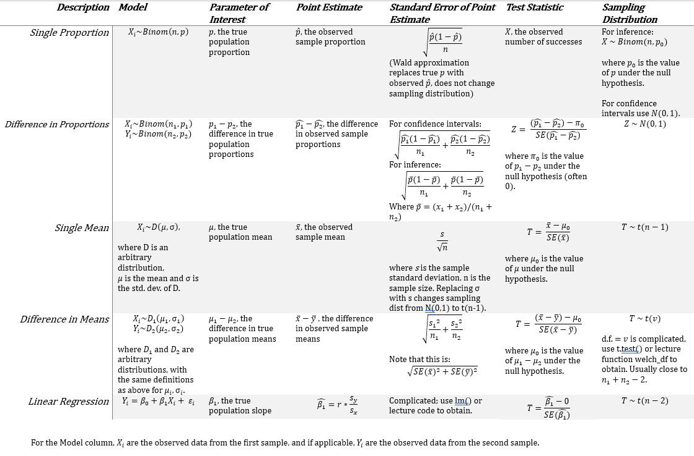

```{r setup, include=FALSE}
knitr::opts_chunk$set(echo = TRUE)
library(tidyverse)
source("../../scripts/ggprob.R")
```

# Concept Review

### Inference Summary



##### Confidence Intervals

Referring to the table above, the confidence interval for a parameter of interest is:

$$
\text{Point Estimate } \pm \text{Critical Value *} \text{ Std. Error of Estimate}
$$

with Point Estimate and Std. Error of Estimate coming from the above table, and the critical value being the $C$ quantile from your sampling distribution, where $C$ is halfway between your confidence level and 1.

##### p-values

Referring to the table above, when conducting a hypothesis test, your p-value depends on your alternative hypothesis.

Let $S$ be the random variable following the sampling distribution.
Let $x$ be your observed test statistic.

+---------+-----------------+----------------------------------------+
| $H_A$   | p-value         | Description                            |
+=========+=================+========================================+
| <       | $P(S < x)$      | Area to the left of $x$                |
+---------+-----------------+----------------------------------------+
| $\gt$   | $P(S > x)$      | Area to the right of $x$               |
+---------+-----------------+----------------------------------------+
| $\neq$  | $P(|S| > |x|)$  | Area further from center than $x$      |
+---------+-----------------+----------------------------------------+

### Homework Level Linear Regression

##### Data

We have  heights (cm) and masses (kg) of 87 Star Wars characters. 

We seek to determine if there is evidence for a relationship between height (predictor, X) and mass (outcome, Y).

```{r}
starwars %>% select(name, height, mass) %>% head()
```

```{r}
# drop_na only required if you have NA's in your data, which this does
# For the purposes of this class, we will only keep points for which we have BOTH X and Y.
starwars_complete = starwars %>% drop_na(height, mass)

# df %>% pull(columnName) is equivalent to df$columnName 
x = starwars_complete %>% pull(height)
y = starwars_complete %>% pull(mass)

xbar = mean(x)
ybar = mean(y)
sx = sd(x)
sy = sd(y)
r = cor(x,y)

c(xbar, ybar, sx, sy, r)

b1 = r *sy/sx
b0 = ybar - b1*xbar

c(b0, b1)
```

```{r}
#lm(...) returns a model object, which you can then pass into other commands like summary(), coef(), sigma(), to obtain different information from it

modelObject = lm(mass ~ height, data = starwars_complete)

summary(modelObject)

coef(modelObject)
```

