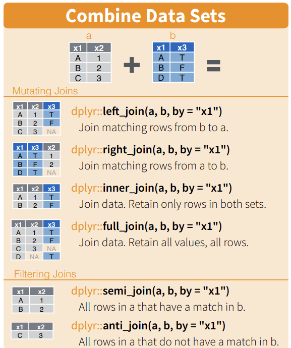

```{r, echo = FALSE, message = FALSE, warning = FALSE}
library(tidyverse)
```

# Concept Review: Joining and Pivoting with tidyr

I use various datasets in this content review, all of which come built in with tidyr specifically for practicing joining and pivoting. Run ```data()``` after loading in the tidyr package (within tidyverse) to see all of them.

## Joining 



Just like the command ```mutate()``` adds columns to dataframes, the family of **mutating joins** takes one dataframe and adds columns to it from another!

right_join works similarly but keeps all rows in the right dataframe, while full_join keeps all rows in either dataframe, and inner_join only keeps rows which appear in both.

```{r}
band_members
band_instruments
```

If you don't specify a column which is shared between the two datasets, it will look for columns with the same name automatically - and send you a message what it found!

left_join keeps all rows in the left dataframe, and merges whatever columns are in the right dataframe, matching by the shared column.

```{r}
left_join(band_members, band_instruments)
```

Note that John and Paul appear as rows 2 and 3 in band_members, while they appear as 1 and 2 in band_instruments, but their instruments are still correctly matched by name. It is matching explicitly by the values in "name", NOT the positions of the rows.

We merge by the column "name"; there is no row in band_instruments where the column "name" takes on the value "Mick", so 'plays' is filled in with NA for "Mick" in the joined dataframe.

What if the two dataframes do not share a common column?

```{r}
band_members
band_instruments2
```

```{r, error = TRUE}
left_join(band_members, band_instruments2)
```

What a descriptive error; the two dataframes "x" and "y" have no common variables! When this is the case, we need to explicitly tell it what columns match up.

The way we do this is with the option ```by = c("column in x" = "matching column in y")```. Note the c() around the two columns which we are saying are equal.

```{r}
left_join(band_members, band_instruments2, by = c("name" = "artist"))
```

Finally, the two **filtering joins**, semi_join and anti_join, just like the command ```filter()```, they keep rows in one dataframe based on whether they do or don't appear in the other dataframe, respectively. Whether or not they match in the other dataframe is evaluated by the shared column; like above, you can let the join command search for it on its own (though it may not behave as you expect) or tell it explicitly.

## Pivoting

```pivot_wider()``` and ```pivot_longer()``` change a dataframe from one orientation to the other. 

A **conceptual understanding** of what these commands do is critical to using them. 

Unlike ```summarize()```, which REDUCES the information contained in your dataframe, the pivoting commands just REARRANGE information.

Consider the following two tables, which contain all the same information (no more, no less), but encoded in two different ways:

```{r}
table1
table2
```

The first table is said to be in "wide" format; many values for one observation are spread out widely in a single row. The second table is said to be in "long" format; many values for one observation are spread out vertically across many rows.

For statistical or visualization purposes, you might need data in either form; but receive it from an external source in a different form. Therefore, it is important to know how to "pivot" between the two.

Converting the wide table1 to the long table2 requires just a single argument; what columns you want to rotate. More often than explicitly writing out every column you want to rotate, you'll use ```-c(columns you want to keep)```.

```{r}
pivot_longer(table1, -c(country, year))
```

The columns which you want to pivot will then take the COLUMN NAMES and scrunch them all into a NEW column, called "name"; and their values will pivot next to them, into the column "value". 

You can specify the names of these columns using names_to and values_to; all this does is save you a rename(), these argument are never necessary.

```{r}
# recall the pipe just passes table1 to be the first argument of pivot_longer

table1 %>% 
  pivot_longer(-c(country, year), names_to = "type", values_to = "count")
```

Going the other way requires two argument to ```pivot_wider()```. We'll be creating new columns based on the values in a single column; we take the names of these columns from the column we specify as ```names_from```. We take the values of these new columns from ```values_from```.

```{r}
pivot_wider(table2, names_from = type, values_from = count)
```


